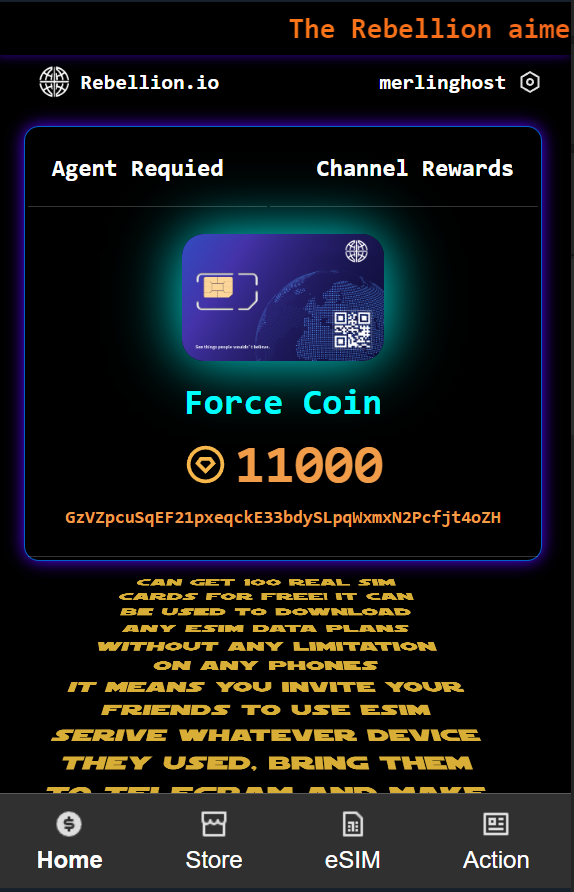
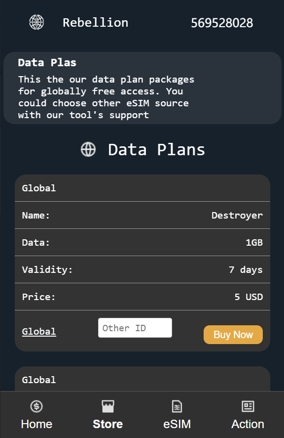
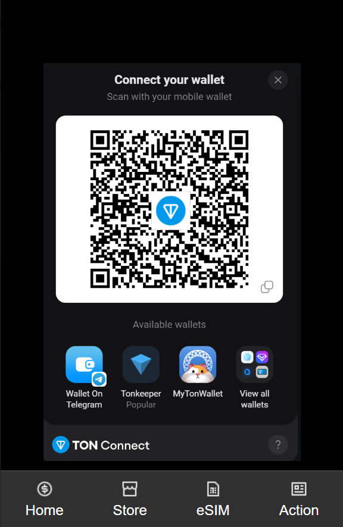
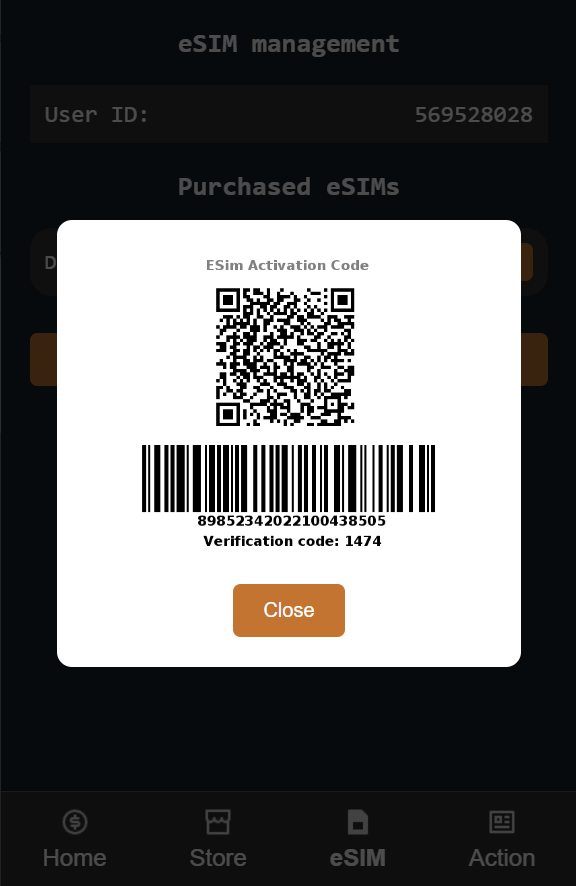
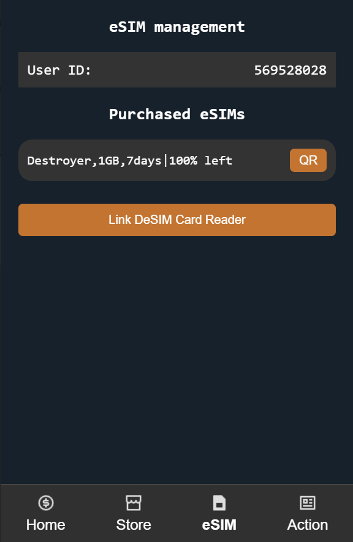
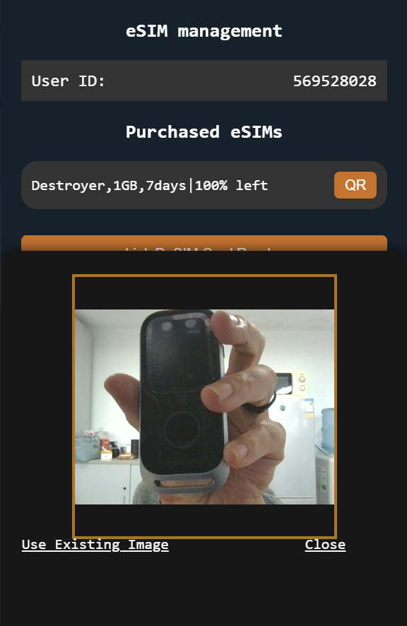
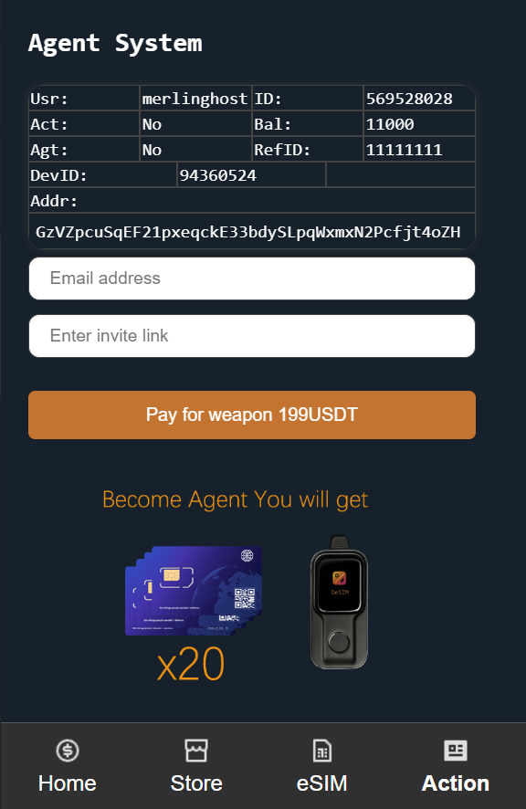
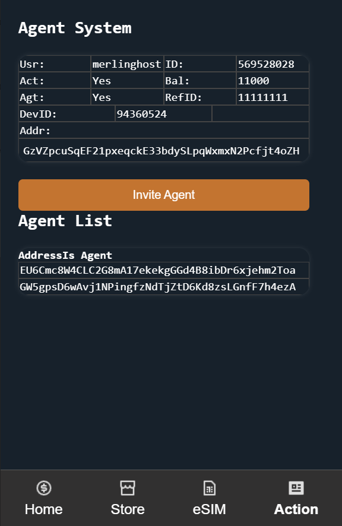
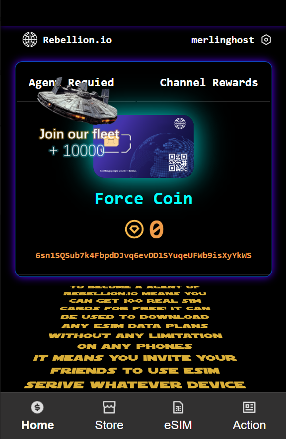

# 🌟 Falcon from DeSIM


> **To make more people to use better network** This project is based on **[soo.network](https://soo.network/)**! 🚀's powerful SVM and telegram mini app to distribute eSIM data plans, eSIM card and hardware terminal. ts goal is to recruit and reward agents to help users manage complex setups. By utilizing standard SIM card hardware, it bypasses various carrier restrictions, allowing users to enjoy unrestricted usage of eSIM technology. Finally, this is just the playground of devlepers from DeSIM to join **[ SOON's hackathon.](https://hackathon.soo.network/)** Don't take the business aspects involved too seriously 🌈

Screenshot of Telegram miniapp
<div style="display: flex; gap: 10px;">
  
  
  
  
</div>
<div style="display: flex; gap: 10px;">
  
  
  
  
</div>

## 📜 Table of Contents
- [🌟 Falcon from DeSIM](#-falcon-from-desim)
  - [📜 Table of Contents](#-table-of-contents)
  - [🌍 Introduction](#-introduction)
  - [✨ Features](#-features)
  - [📦 Installation](#-installation)
  - [🚀 Usage](#-usage)
  - [📜 License](#-license)
  - [📬 Contact](#-contact)

## 🌍 Introduction

Welcome to **Falcon**! 

As of 2023, there are over 100 million eSIM downloads globally each year. However, telecom operators, driven by their commercial interests or national regulations, have imposed many restrictions on eSIM applications, preventing users from making choices based on their own preferences or best interests. The Falcon project aims to change this by providing a standard eSIM card issued based on GSMA standards, allowing users to freely use eSIM technology and make optimal choices.

We have observed that using eSIM involves the use of complex software, and even certain hardware limitations on mobile devices. Therefore, this project aims to recruit and reward the most active users within the community, providing them with both software and hardware support. These users will help others around them to adopt this technology and identify more active users, allowing our product to spread widely.

## ✨ Features
<div style="display: flex; gap: 10px;">
  
</div>

- 🌟 **Auto Registration**: When a telegram user start our bot(mini app), the account is set automatically and user will have the token address immediately.
  
- 🛠️ **Click to Buy**: Users can purchase plans directly by clicking on them in the store, using various payment methods provided by Telegram. They can even complete purchases through services like Telegram Stars, which allows for integration with fiat currency
  
- 🔒 **Toekn Reward**: After making a purchase, users will immediately receive token rewards and see the results, thanks to the high availability and low latency of the SOON network.
  
- 📊 **Help by Agent**: If users encounter any difficulties while setting up their eSIM, nearby agents can immediately assist them with downloading or recharging. Agents will receive token rewards for these actions.

- 📜 **Become Agent**: Users can become new agents by paying for a set of equipment after receiving an invitation from an existing agent. Both the inviter and the invitee will receive a token reward. In fact, this cost is very low compared to the exorbitant prices charged by profit-driven telecom operators, making it a highly attractive feature. This is also why the project has the potential to spread widely.
  

## 📦 Installation

If you want to download and run this project, here are the steps you need to follow::

1. Clone the repository:
   ```bash
   git clone https://github.com/chesterliliang/Falcon.git
   ```
2. Navigate to the contract(Program) directory first:
   ```bash
   cd forcecoin
   cd program
   ```
   To build the program, you should have solana cli and rust, just follow  **[ SOON's guide.](https://docs.soo.network/building-on-soon/set-up-the-development-environment/)**  Then the command is:

   ```
   cargo build-sbf
   ```
3. Deploy the program:
   ```bash
   solana program deploy ./program/target/so/filecoin.so
   ```


## 🚀 Usage

After installation, you can start the frontend/miniapp by running:

```bash
npm run dev
```
Then ngrok it and set menu URL by BotFather to your bot

```
ngrok http https://localhost:5174
```

Start backend by 
```
cd src
node http.js
```
mini-app will access the web interface at [http://localhost:5174](http://localhost:3000). 


## 📜 License

Distributed under the MIT License. See `LICENSE` for more information.


## 📬 Contact

If you have any questions or feedback, feel free to reach out:

tg: merlinghost 😊

